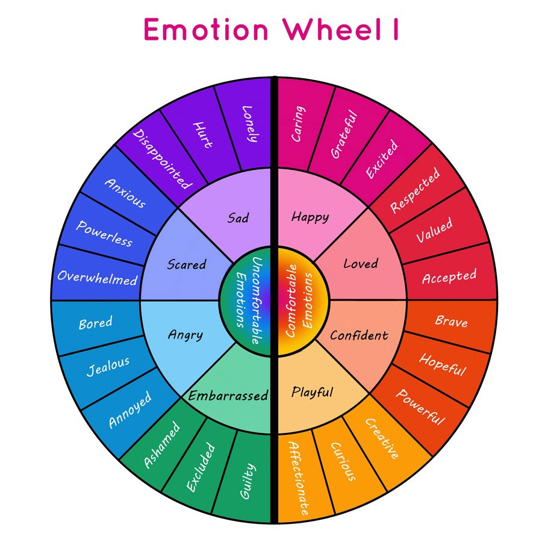

# Watch-Your-Mouth
The project is made by Caleb Hairston, Eric (Linjun Zhou) and Joshua Burell. By implementing automated system powered by Twilio and Cohere, our project can gives you insight into how the message may sound before you send the impulsive tweet or text.

## 😶Inspiration
In recent years the number of cancellations has been at an all-time high, partly due to impulsive tweeting. To help our favorite rappers, politicians, and comedians who obviously should have used a sounding board, we have created a private messaging service that can give critical insights into how you may come off with 90% or greater accuracy. 

## 🧠What it does
It was targeted at teenagers and people with mental illness, the most likely population segments to send an impulsive message(s) to prevent them from sending less than the thought-out message(s) during a stress-induced episode. Before you tweet or make a potentially risky post, text our open line to receive insights. In addition, this could be interpreted by people living with ASD (Autism Spectrum Disorder) to solve other people's messages to avoid misunderstandings and as a much-needed educational resource. 

## 🚧How we built it
First, we collect over 1100 messages through web scrapers and by hand. We then created a Python automation for sorting, dividing, and formatting as a CSV file. The information was divided into training and validation set at a 10:1 ratio. We then fed it through the Cohere NLP model. Our model passed our P value of 12.5%, thus validating our minimum standards for determining the 11 emotions + 3 Contexts. As we know, sms is more area accessible but less financial as the text still charges some people; we created a react webpage with the same functionality.  

## 📱Challenges we ran into
The Twilio service was experiencing multiple bugs preventing outgoing messages from being sent. Currently, we are running low on twillio credits.  

## 🥇Accomplishments that we're proud of
We are proud to work with an interdisciplinary team where half were first-time hackers, and the other half were non-computer science students. In addition, we put an extra amount of time into this project.  

## 🍎What we learned
We learned how to train and validate a learning model. 

## 📝What's next for Watch your Mouth
We hope to add more context identifier categories and the function to help you rewrite with the proper tone. 

<!-- ## Website Link
https://watchyourmouth.tech -->

## ✨Project Pictures

